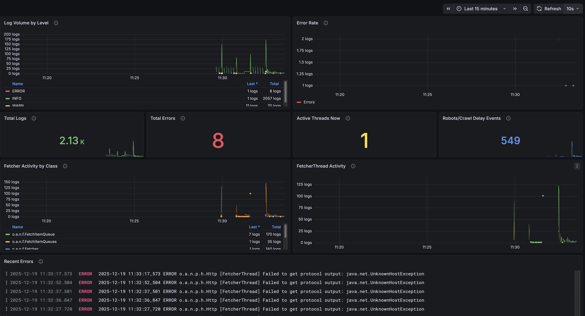
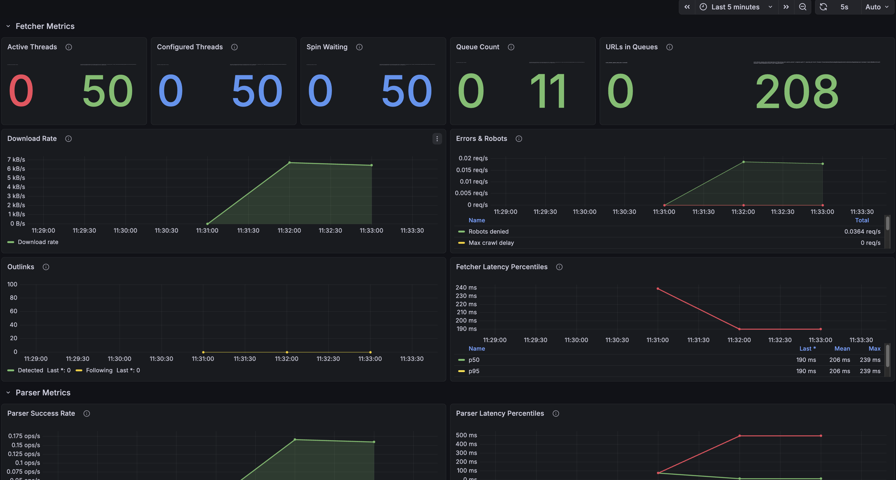

# nutch-grafana-resources

Grafana Dashboards and Alloy Collector resources for monitoring [Apache Nutch](https://nutch.apache.org/) web crawler.

## Overview

This repository provides ready-to-use Grafana resources for observing Apache Nutch crawl jobs, including:
- **Grafana Alloy configuration** for collecting logs and extracting metrics
- **Grafana dashboards** for visualizing crawler performance and activity

## Resources

### `alloy/config.alloy`

[Grafana Alloy](https://grafana.com/docs/alloy/) configuration that:

- **Collects Nutch logs** from the local runtime directory
- **Parses Log4j2 format** with multiline support for stack traces
- **Extracts Prometheus metrics** from Hadoop counter output in logs
- **Forwards logs** to Loki ([Grafana Cloud](https://grafana.com/products/cloud/) or local)
- **Forwards metrics** to Prometheus ([Grafana Cloud](https://grafana.com/products/cloud/) or local)

#### Metrics Extracted

The configuration extracts metrics from the following Nutch components (based on [`org.apache.nutch.metrics.NutchMetrics`](https://github.com/apache/nutch/blob/master/src/java/org/apache/nutch/metrics/NutchMetrics.java)):

| Component | Metrics |
|-----------|---------|
| **Fetcher** | Active threads, spin waiting, queue sizes, bytes downloaded, robots denied, redirects, timeouts, latency (p50/p95/p99) |
| **Generator** | URL filter rejections, schedule rejections, score filtering, malformed URLs |
| **Indexer** | Documents indexed, deleted (robots/gone/redirects/duplicates), skipped, errors, latency |
| **CrawlDB** | URLs filtered, gone/orphan records removed, status counts (fetched/unfetched/gone/redirects) |
| **Injector** | URLs injected, unique URLs, merged URLs, purged URLs |
| **HostDB** | Host counts (new/existing/purged), filtered records |
| **Parser** | Parse success count, latency metrics |
| **Deduplication** | Documents marked as duplicate |
| **WebGraph** | Links added/removed |
| **Sitemap** | Seeds extracted, sitemaps discovered, failed fetches |
| **WARC Exporter** | Records generated, missing content/metadata, invalid URIs |
| **Domain Stats** | Fetched/not fetched URLs per domain |

#### Setup

1. Create credential files for [Grafana Cloud](https://grafana.com/products/cloud/) (or configure local endpoints):
   ```bash
   mkdir -p ~/.config/alloy
   echo -n "your_loki_username" > ~/.config/alloy/loki_username
   echo -n "your_prometheus_username" > ~/.config/alloy/prometheus_username
   echo -n "your_api_key" > ~/.config/alloy/grafana_cloud_api_key
   chmod 600 ~/.config/alloy/grafana_cloud_api_key
   ```

2. Update paths in `config.alloy`:

   **Credential file paths** — Update the `local.file` blocks with your paths:
   ```alloy
   local.file "loki_username" {
     filename  = "/home/youruser/.config/alloy/loki_username"
     is_secret = false
   }
   ```

   **Nutch logs path** — Update `local.file_match` to point to your Nutch logs directory:
   ```alloy
   local.file_match "nutch_logs" {
     path_targets = [
       {
         "__path__" = "/home/youruser/nutch/runtime/local/logs/*.log",
         ...
       },
     ]
   }
   ```

   **[Grafana Cloud](https://grafana.com/products/cloud/) URLs** — Update `loki.write` and `prometheus.remote_write` with your instance details (found in your Grafana Cloud portal):
   ```alloy
   loki.write "grafanacloud" {
     endpoint {
       url = "https://logs-prod-<INSTANCE>.grafana.net/loki/api/v1/push"
       ...
     }
   }

   prometheus.remote_write "grafanacloud" {
     endpoint {
       url = "https://prometheus-prod-<INSTANCE>-<REGION>.grafana.net/api/prom/push"
       ...
     }
   }
   ```

3. Run Alloy with the configuration:
   ```bash
   alloy run config.alloy
   ```

### `dashboards/`

Pre-built Grafana dashboards for monitoring Nutch crawls.

#### `nutch_crawler_monitoring.json`

**Log-based monitoring dashboard** using Loki as the datasource:
- Log rate by level (INFO, WARN, ERROR)
- Real-time log viewer with filtering
- Crawler activity timeline



#### `nutch_metrics_dashboard.json`

**Comprehensive metrics dashboard** using Prometheus as the datasource:
- **Fetcher Metrics**: Active threads, queue sizes, bytes downloaded, latency percentiles
- **Parser Statistics**: Parse success rates and latency
- **CrawlDB State**: URL status distribution (fetched, unfetched, gone, redirects)
- **Indexer Performance**: Documents indexed, deleted, and error rates
- **Generator Stats**: URL filtering and rejection reasons



#### Importing Dashboards

See [Import dashboards](https://grafana.com/docs/grafana-cloud/visualizations/dashboards/build-dashboards/import-dashboards/) in the Grafana documentation.

## Requirements

- [Apache Nutch](https://nutch.apache.org/) (with metrics logging enabled)
- [Grafana Alloy](https://grafana.com/docs/alloy/) for log/metrics collection
- [Grafana](https://grafana.com/) with Loki and Prometheus datasources

## License

Licensed under the Apache License, Version 2.0. See [LICENSE](LICENSE) for details.
